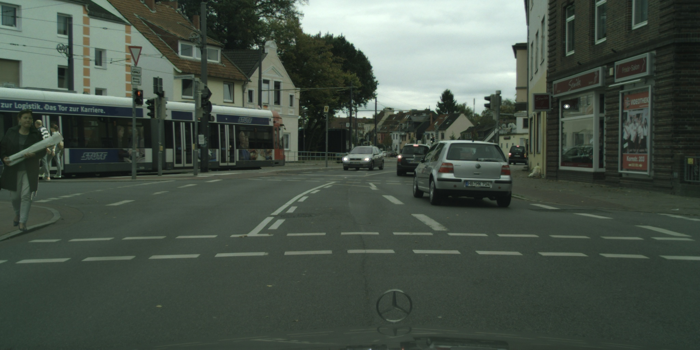
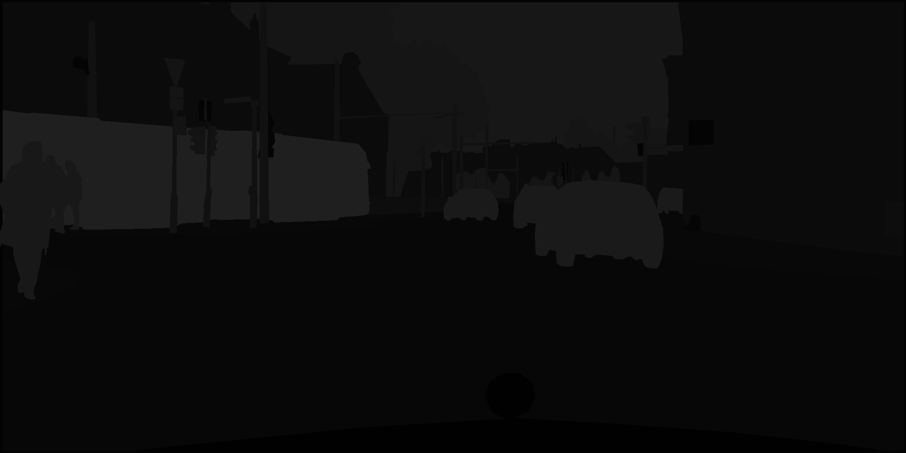
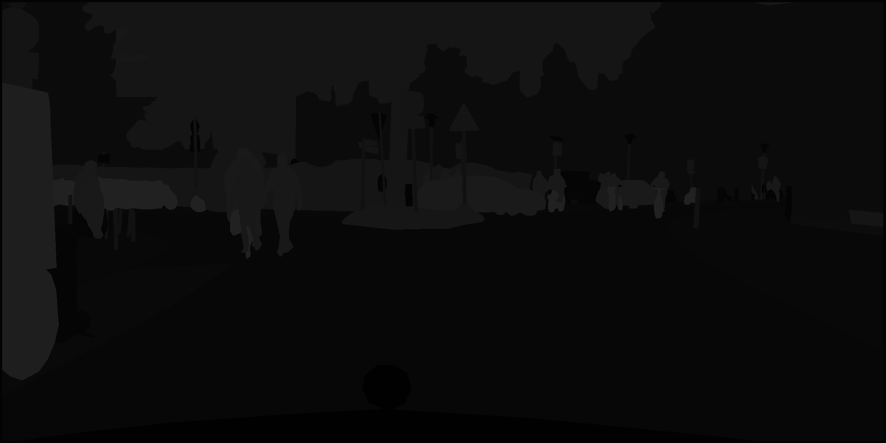
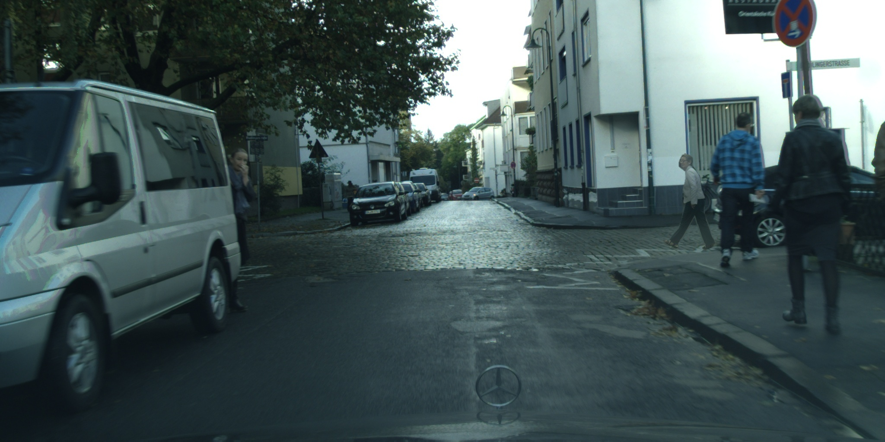
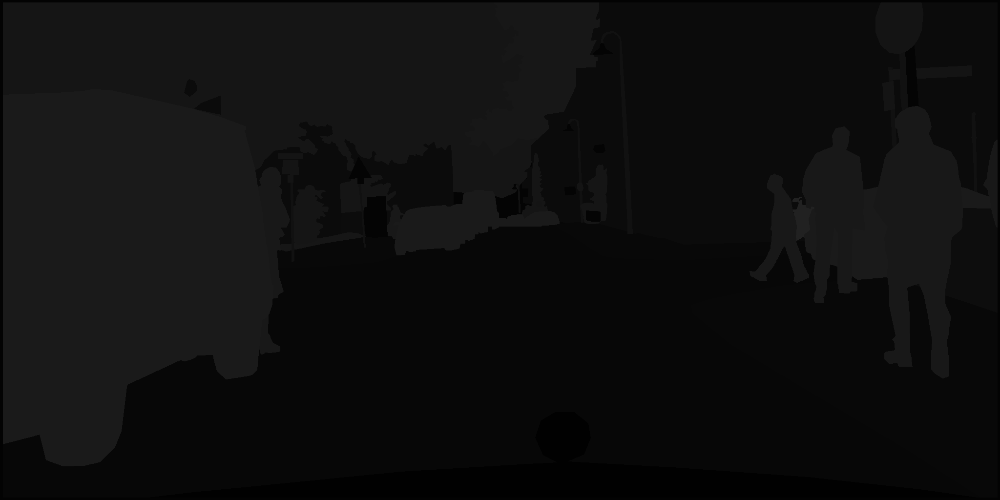

# *Image data augmentation*

## *Basic approaches*

### Requirements for the important packages
- opencv-python 4.3.0.36
- tensorflow 1.15.0 

### Explanation
#### Path creating script
For the first step, the path_creating script must be run. 
It is to adjust the paths.
After the program execution, two csv files are created, which consist of the list of paths. 
Each path is the address where the respective image is placed.

#### Basic image augmentation script
For the second step, the basic image augmentation script must be running.
The dataset is created from the classic augmented images and the corresponding masks. 
The number of dataset images must be specified, which is initialized as dataset_size. 

### Usage
#### Setup
You need to install the packages which are used by the scripts. If you are working on your private computer you can simply install them into your global python environment (which is not recommended).
If you work on the server you first need to setup a [virtualenv](https://docs.python.org/3/library/venv.html).  
[Virtualenvwrapper](https://virtualenvwrapper.readthedocs.io/en/latest/) is installed on the servers which makes it easier to work with python virtualenvs.  
You can create a new virtualenv with `mkvirtualenv image_augmentation --python=/usr/bin/python3` where `image_augmentation` is the name of the virtualenv. You can set that according to your preferences.
After that you should see `(image_augmentation)` at the beginning of your terminal text line. This means you are currently using the virtualenv. You can deactivate the virtualenv with `deactivate`. 
If you want to continue workin inside the virutalenv you can activate it with `workon image_augmentation`. 
You can use `pip install -r requirements.txt` to install all packages you need for the scripts. Keep in mind that you should only install the packages inside the virtualenv. Otherwise your global python environment will be cluttered.

#### Jupyter Notebook
Currently it is not possible to work on the server with jupyter notebook. But you can use it on your private pc to tinker with the scripts.

#### Python Script
You first need to run `python path_creating/path_creating.py`  
You may get this error: `ImportError: OpenCV loader: missing configuration file: ['config-3.6.py', 'config-3.py']. Check OpenCV installation.`. 
Then you need to use the command: `unset PYTHONPATH` to remove the references to the global opencv installation.  
You can run the script with some additional arguments:  
```bash
usage: path_creating.py [-h] [--output-dir OUTPUT_DIR] [--json-dir JSON_DIR] [--processes PROCESSES]
  -h, --help            show this help message and exit
  --output-dir OUTPUT_DIR
                        Choose the destination where you want to save the output csv to
  --json-dir JSON_DIR   Provide the PATH_TO_CITYSCAPES/cityscapes/gtFine
  --processes PROCESSES
                        Set the number of processes for multiprocessing
```
The default values for the arguments are:  
`OUTPUT_DIR = ./basic_approaches`  
`JSON_DIR = /mrtstorage/datasets/public/cityscapes/gtFine`  
`PROCESSES = 16`   

You then can run `python basic_approaches/basic_img_augmentation.py`   
(e.g. python basic_approaches/basic_img_augmentation.py --dataset-size 11 --output-path /home/admin1/gp-gan_augmentation/basic_approaches/DataBase --fg /home/admin1/gp-gan_augmentation/basic_approaches/citysc_fgPaths.json --bg /home/admin1/gp-gan_augmentation/basic_approaches/citysc_bgPaths.json --process 4)

You can run the script with some additional arguments:   
```bash
usage: basic_img_augmentation.py [-h] [--dataset-size DATASET_SIZE] [--output-path OUTPUT_PATH] [--fg FGPATHS] [--bg BGPATHS] [--process NUM_PROCESSES]

Create the augmented dataset for cityscapes.

optional arguments:
  -h, --help            show this help message and exit
  --dataset-size DATASET_SIZE
                        Choose the size of the created dataset
  --output-path OUTPUT_PATH
                        Choose where the created images are saved to.
  --fg FGPATHS          Select the csv files which where created by the path_creating script
  --bg BGPATHS          Select the csv files which where created by the path_creating script
  --process NUM_PROCESSES
                        Select the number of processes

```
The default values for the arguments are:  
`DATASET_SIZE = 50`  
`OUTPUT_PATH = ./created_dataset`  
`FGPATHS = ./basic_approaches/citysc_fgPaths.csv`  
`BGPATHS = ./basic_approaches/citysc_bgPaths.csv`  
`NUM_PROCESSES = 4`  


### For more information read Basic_&_deep_learning_approaches.pdf


## *GP-GAN*

You can find the original implementation in Chainer [here](https://github.com/wuhuikai/GP-GAN)

or [here](https://github.com/visitor9999th/Tensorflow_GP-GAN)


### Explanation
#### Download the cityscapes dataset [here](https://www.cityscapes-dataset.com/)

#### Place the dataset
Place the dataset as follows:

Directory structure of the the dataset
```
root/CITYSCAPES_DATASET
     │
     └──gtFine_trainvaltest
     │  │
     │  └──gtFine       
     │     │
     │     └──test
     │     │   ...
     │     │   ...
     │     └──train
     │     │   ...
     │     │   ...
     │     └──val 
     │         ...
     │	       ...
     │
     └──leftImg8bit_trainvaltest
        │
        └──leftImg8bit      
           │
           └──test
           │   ...
           │   ...
           └──train
           │   ...
           │   ...
           └──val 
               ...
	       ...
```

#### Generate images script
For the first step, the generate_images script must be run. 
It is to create a database in the /GP-GAN/DataBase/train_data folder for GP-GAN training.

#### Write tf records script
To further train the GP-GAN neural network, let's record the data in .tfrecords format.

#### Train blending gan script
The next step is to train the GP-GAN 

#### TensorBoard script
TensorBoard can be used to track neural network training

#### Run gp gan 
After training the GAN, we can load the weights and blend images.


#### Python Script
You first need to run `python GP-GAN/generate_images.py`  
(e.g. python GP-GAN/generate_images.py --dataset_size 31 --dataset_dir  '/home/admin1/CITYSCAPES_DATASET' --save_dir '/home/admin1/gp-gan_augmentation/GP-GAN/DataBase')

You can run the script with some additional arguments:   
```bash
usage: generate_images.py [-h] [--dataset-size] [--img_shape] [--dataset_dir] [--save_dir] [--highBrightness_value] [--lowBrightness_value] [--highContrast_value] [--lowContrast_value]

Create the augmented dataset for GP-GAN training.

optional arguments:
  -h, --help            show this help message and exit
  --dataset-size 
                        Choose the size of the created dataset
  --img_shape 
                        Choose the shape of the created images
  --dataset_dir 
                        Chosse the direction of the cityscapes dataset
  --save_dir 
                        Choose where the created images are saved to
  --highBrightness_value 
                        Choose the high brightness value
  --lowBrightness_value 
                        Choose the low brightness value
  --highContrast_value 
                        Choose the high contrast value
  --lowContrast_value 
                        Choose the low contrast value

```
The default values for the arguments are: 

`dataset_size = 51`  
`img_shape = 64`  
`dataset_dir = ./CITYSCAPES_DATASET`
`save_dir = ./DataBase`  
`highBrightness_value = 50`  
`lowBrightness_value = -50`  
`highContrast_value = 30`  
`lowContrast_value = -30`  


You have to run `python GP-GAN/write_tf_records.py`  
(e.g. python GP-GAN/write_tf_records.py --dataset_dir '/home/admin1/gp-gan_augmentation/GP-GAN/DataBase/train_data')

You can run the script with some additional arguments:   
```bash
usage: generate_images.py [-h] [--dataset_dir] 

Create the tfrecords files of the dataset.

optional arguments:
  -h, --help            show this help message and exit
  --dataset_dir 
                        Chosse the direction of the cityscapes dataset
```
The default values for the arguments are: 

`dataset_dir = ./DataBase/train_data`


You have to run `python GP-GAN/train_blending_gan.py`  
(e.g. python GP-GAN/train_blending_gan.py --train_data_root /home/admin1/gp-gan_augmentation/GP-GAN/DataBase/train_data/train.tfrecords --val_data_root /home/admin1/gp-gan_augmentation/GP-GAN/DataBase/train_data/val.tfrecords --save_folder 'output_path' --experiment "experiment_name")


You have to run TensorBoard `tensorboard --logdir="path to tensorboard folder"`  

Under Scalars you will find the training graphs. The X axis represents cycle
  (each cycle includes N discriminator steps and 1 generator step).
  
  - Training_disc_loss: Discriminator loss. Calculated as _train_disc_value_real - train_disc_value_fake_.
  - Train_disc_value_fake: Output value from the discriminator for fake (generated) images.
  - Train_disc_value_real: Output value from the discriminator for real images.
  - Train_gen_disc_component: From the generator loss, the component representing how much you fool the discriminator.
  - Train_gen_l2_component: From the generator loss, the component representing the l2 difference between generated image and background (destination) image.
  - Train_gen_loss: Total generator loss as the sum of the previous 2 components.
  - Val_disc_loss: Validation discriminator loss.
  - Val_gen_loss: Validation generator loss.
  
  _Notice that resuming training from a checkpoint that's older
   than the last logged value in tensorboard can result in a graph that goes back and forward again._


Alternatively, you can create the appropriate folders yourself and place the trained neural network model there (Ask Kevin Roesch, kevin.roesch@kit.edu):

`gp-gan_augmentation/GP-GAN/output_path/experiment_name/GP-GAN_2021-06-13-07-35-07.ckpt-215170410005.data-00000-of-00001`

`gp-gan_augmentation/GP-GAN/output_path/experiment_name/GP-GAN_2021-06-13-07-35-07.ckpt-215170410005.index`

`gp-gan_augmentation/GP-GAN/output_path/experiment_name/GP-GAN_2021-06-13-07-35-07.ckpt-215170410005.meta`


After training the GAN, we can load the weights and blend images. The supported input is a source image, a destination image and a binary mask.
You have to run `python GP-GAN/run_gp_gan.py`  
(e.g. python GP-GAN/run_gp_gan.py  --generator_path 'output_path/experiment_name/GP-GAN_2021-06-13-07-35-07.ckpt-215170410005')

Plotting of the results:
| Image | Mask |
| --- | --- |
|  |  | 
| --- | --- |
|  |  | 
| --- | --- |
|  |  | 

### For more information read Basic_&_deep_learning_approaches.pdf
